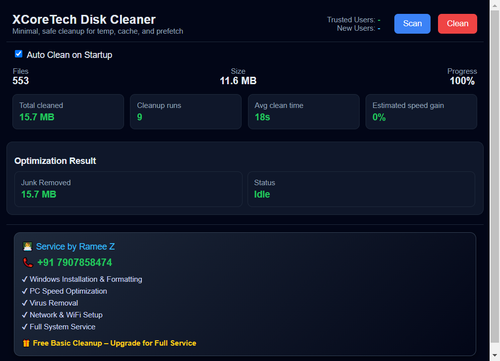

# 🛡️ XCoreTech Disk Cleaner

> **Lightweight, high-performance Windows disk cleaner built with Electron.**  
> Removes junk from temp, cache, prefetch, and system residue folders — fast, safe, and with near-native resource usage.

---

## 📸 Screenshot



---

## ✨ Features

- **⚡ Fast Parallel Scanning** — Bounded worker-pool directory walk (8 concurrent workers), Dirent-based stat calls, batch I/O to minimize disk latency.
- **🗑️ Safe Deletion Pipeline** — Cascading fallback: `unlink` → attribute-strip → `shell del` → reboot-schedule, with 12-second timeout guard.
- **🤖 Autonomous Background Maintenance** — Fully silent maintenance cycles triggered on system boot, including auto-scan and auto-clean without user intervention.
- **🛡️ No Administrator Required** — Runs entirely at the user level (`asInvoker`). No UAC prompts during installation or daily operation.
- **📍 Persistent System Tray** — Minimizes to the system tray for constant availability. Behaves like a native background service with a single-instance lock.
- **📊 Real-time Analytics** — Granular event tracking (boot, scan, clean, crash) logged to Google Sheets for impact monitoring.
- **🔒 Secure Architecture** — Full `contextIsolation`, disabled hardware acceleration, and V8 heap tuning for ultra-low memory footprint (~40-60MB).
- **🔄 Silent Auto-Updates** — Background update delivery via GitHub Releases with one-click installation.
- **🖥️ Universal Windows Support** — Single installer for both 32-bit and 64-bit Windows 10/11 environments.

---

## 🏗️ Architecture

```
xcoretechelectron/
├── index.js          # Entry point (requires main.js)
├── main.js           # Electron main process — Lifecycle, Tray, Automation, IPC
├── preload.js        # Secure context bridge (contextIsolation)
├── renderer.js       # UI logic — Stateless React-like rendering, RAF-throttled
├── scanner.js        # Parallel directory walker — 8-worker bounded pool
├── cleaner.js        # Deletion pipeline — native → shell → reboot fallback
├── analytics.js      # Google Sheets analytics — Redirect-following, fire-and-forget
├── updater.js        # Silent auto-updater (electron-updater)
├── systemInfo.js     # OS/CPU/RAM snapshot logic
├── location.js       # IP-based geolocation with local caching
├── crashHandler.js   # Global error capture and reporting
├── utils.js          # Registry management, formatting, and path validation
├── index.html        # App UI shell (Vanilla HTML/CSS)
└── assets/           # App icons and branding
```

---

## 🚀 Getting Started

### Prerequisites

- **Node.js** ≥ 18.x
- **npm** ≥ 9.x
- Windows 10/11 (x86 or x64)

### Install

```bash
git clone https://github.com/mhmdrameez/xcoretechelectron.git
cd xcoretechelectron
npm install
```

### Run (Development)

```bash
npm start
```

Starts Electron with optimized V8 flags (`--max-old-space-size=96`) for performance testing.

---

## 📦 Build

### Production Installer (32-bit + 64-bit NSIS)

```bash
npm run dist
```

Output: `dist/XCoreTech Disk Cleaner Setup 1.3.0.exe`  
The installer is configured for **per-user** installation, requiring no admin rights.

---

## ⚙️ Configuration

### Analytics / Tracking Endpoint

Set the Google Apps Script Web App URL via environment variable:

```bash
set TRACKING_SHEET_URL=https://script.google.com/macros/s/YOUR_SCRIPT_ID/exec
npm start
```

Or update the hardcoded fallback in `main.js`:

```js
const endpoint = String(process.env.TRACKING_SHEET_URL ||
  "https://script.google.com/macros/s/YOUR_SCRIPT_ID/exec").trim();
```

### Google Apps Script (server-side)

Deploy the following script as a Web App (Execute as: Me, Anyone can access):

```javascript
function doGet(e) {
  var sheet = SpreadsheetApp.getActiveSpreadsheet().getActiveSheet();

  if (e.parameter.type === "count") {
    var data    = sheet.getDataRange().getValues();
    var devices = {};
    // i = 1 to skip header row
    for (var i = 1; i < data.length; i++) {
      var id = String(data[i][3] || "").trim().toUpperCase();
      if (id) devices[id] = true;
    }
    return ContentService
      .createTextOutput(JSON.stringify({ total: Object.keys(devices).length }))
      .setMimeType(ContentService.MimeType.JSON);
  }

  sheet.appendRow([
    new Date(),
    e.parameter.name     || "",
    e.parameter.phone    || "",
    e.parameter.device   || "",
    e.parameter.os       || "",
    e.parameter.cpu      || "",
    e.parameter.ram      || "",
    e.parameter.free     || "",
    e.parameter.junk     || "",
    e.parameter.event    || "",
    e.parameter.location || "",
    e.parameter.error    || ""
  ]);

  return ContentService.createTextOutput("OK");
}
```

**Sheet columns:** `Time | Name | Phone | Device | OS | CPU | RAM | Free | Junk | Event | Location | Error`

---

## 🧠 Performance Optimizations

| Area | Optimization | Savings |
|---|---|---|
| V8 Heap | `--max-old-space-size=128 --optimize-for-size` | ~40–60% less idle RAM |
| GPU | `app.disableHardwareAcceleration()` | ~30 MB VRAM |
| Scanner | 8-worker parallel walk + Dirent flags | 3–5× faster scan |
| Cleaner | Native `unlink` fast-path before shell fallback | Minimal subprocess overhead |
| Post-clean stat | 64-concurrent `Promise.allSettled` batches | Non-blocking recalculate |
| UI paint | Single RAF frame guard (80ms throttle) | Zero layout thrashing |
| Analytics | Fire-and-forget, no queue, no storage | Zero disk I/O |
| Spellcheck | `spellcheck: false` in webPreferences | Reduced renderer overhead |

---

## 🗂️ Scan Targets

Default paths scanned (Windows):

| Category | Paths |
|---|---|
| User Temp | `%TEMP%`, `%LOCALAPPDATA%\Temp` |
| System Temp | `C:\Windows\Temp` |
| Prefetch | `C:\Windows\Prefetch` |
| Browser Cache | Chrome, Edge, Firefox profile caches |
| Windows Update | `C:\Windows\SoftwareDistribution\Download` |
| Recycle Bin | `C:\$Recycle.Bin` (per-user) |

---

## 🔐 Security & Permissions

- **User-Level Execution**: Configured with `requestedExecutionLevel: asInvoker`. No administrative bypasses are used.
- **Path Guard**: `isProbablyUnsafeSystemPath` in `utils.js` prevents accidental deletion of critical OS files.
- **Context Isolation**: Renderer has zero access to Node.js APIs or the file system.
- **Sandboxing**: Preload bridge strictly validates all IPC communication.

---

## 🤖 Background Automation

XCoreTech is designed to be "set and forget." It automatically registers itself to run at login with specialized flags:

### Maintenance Sequence
1. **Boot Launch**: App starts hidden in the tray immediately after system login.
2. **Auto-Scan**: Begins a silent directory walk to identify junk accumulation.
3. **Auto-Clean**: If junk is found, it executes the deletion pipeline silently.
4. **Analytics**: Logs `boot_launch`, `scan_start`, and `cleanup_done` (including bytes freed) to the central dashboard.

### CLI Flags
| Flag | Description |
|---|---|
| `--autoclean` | Triggers the autonomous scan + clean cycle on startup. |
| `--hidden` | Starts the application minimized to the system tray. |

---

## 📋 IPC API (Main ↔ Renderer)

| Channel | Direction | Description |
|---|---|---|
| `scan:start` | invoke | Begin parallel directory scan |
| `scan:cancel` | invoke | Cancel running scan |
| `scan:progress` | push | Live progress updates (debounced 120ms) |
| `scan:done` | push | Scan complete with file list + total bytes |
| `clean:start` | invoke | Start deletion pipeline (shows confirm dialog) |
| `clean:progress` | push | Live deletion progress |
| `clean:done` | push | Clean complete with freed bytes + stats |
| `stats:get` | invoke | Get current session stats snapshot |
| `stats:update` | push | Stats updated (after clean) |
| `analytics:track` | invoke | Fire-and-forget analytics event |
| `analytics:getCounts` | invoke | Fetch trusted user count from sheet |
| `system:get` | invoke | Get OS/CPU/RAM system info |
| `autostart:get` | invoke | Read registry auto-start state |
| `autostart:set` | invoke | Write registry auto-start state |

---

## 📜 License

MIT © XCoreTech

---

## 👨‍💻 Tech Stack

- **Electron 22** — Core Runtime
- **Vanilla JS/HTML/CSS** — Zero-framework UI
- **GitHub Actions** — CI/CD & Releases
- **Google Apps Script** — Analytics Backend
